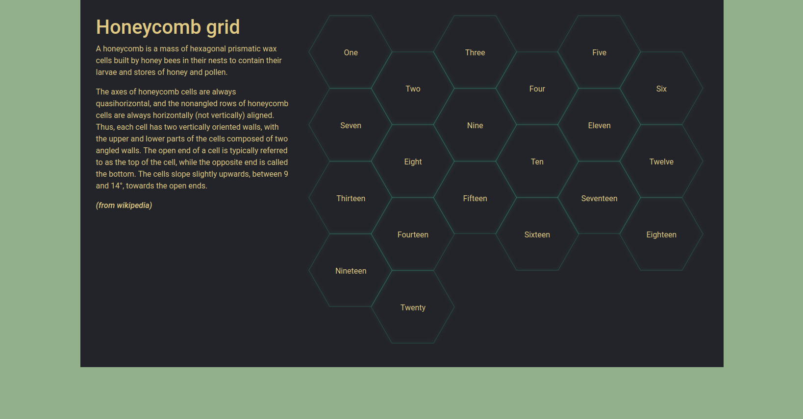

# Honeycomb grid

A simple example of responsive honeycomb grid using mostly CSS and just a bit of JS (as container queries are not available yet).

[See it in action](https://thomaslobjoie.github.io/honeycomb-grid/)
